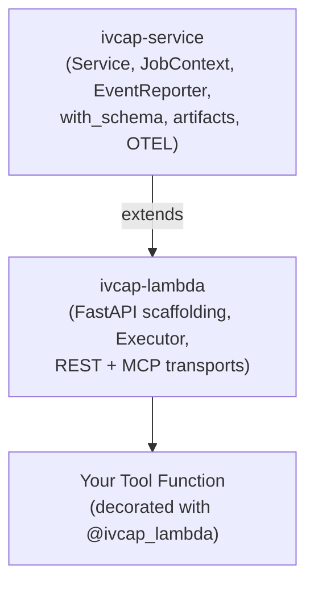
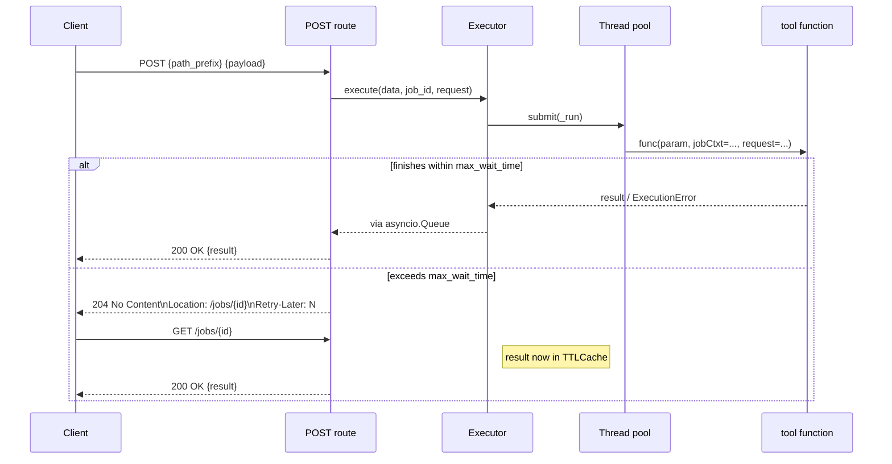
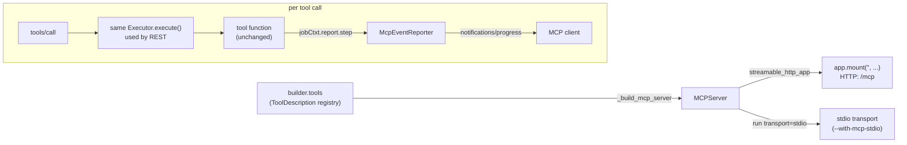

# Design: `ivcap-lambda`

This document describes the internal architecture of `ivcap-lambda`, the design
decisions behind it, and the rationale for the MCP (Model Context Protocol)
support in particular. It is aimed at contributors to this repository, not at
users of the library (see [README.md](./README.md) and [AGENTS.md](./AGENTS.md)
for the user-facing API).

## 1. Purpose & Scope

`ivcap-lambda` turns a plain Python function into a set of IVCAP-compatible
HTTP endpoints (and, optionally, an MCP server) with a single decorator:

```python
@ivcap_lambda("/process", opts=ToolOptions(tags=["Text"]))
def process(req: MyRequest, jobCtxt: JobContext) -> MyResult:
    ...
```

It sits on top of [`ivcap-service`](https://github.com/ivcap-works/ivcap-service-sdk-python),
which supplies the platform-agnostic primitives (`Service`, `JobContext`,
`EventReporter`, `with_schema`, artifact access, OTEL bootstrap, sidecar event
reporting) shared with the batch/queue-based `ivcap-service` programming
model. `ivcap-lambda` adds the FastAPI/uvicorn HTTP scaffolding, async job
execution semantics, and (optionally) an MCP transport, so that the *same*
tool-function code is reachable over REST, the "try-later" polling protocol,
and MCP without being rewritten for each transport.



## 2. Module Layout

| Module | Responsibility |
|---|---|
| `ivcap_lambda/decorators.py` | The `@ivcap_lambda(...)` decorator — thin wrapper around `builder.add_tool_api_route` |
| `ivcap_lambda/builder.py` | Core registration logic: builds the `POST`/`GET /jobs/{id}`/`GET` REST routes for a tool, maintains the module-level `tools: list[ToolDescription]` registry (the single source of truth every transport reads from) |
| `ivcap_lambda/executor.py` | `Executor` — runs a tool function in a thread pool, bridges sync/async functions, manages the job-result cache (`TTLCache`), injects `JobContext` via a `contextvars.ContextVar`, propagates OTEL spans across threads |
| `ivcap_lambda/server.py` | `start_lambda_server(...)` — CLI argument parsing, FastAPI app wiring, health check, OTEL instrumentation, lifecycle/shutdown handling, dispatches to the MCP HTTP/stdio entry points |
| `ivcap_lambda/mcp.py` | Optional MCP adapter (see §4) built on the official `mcp` SDK |
| `ivcap_lambda/health_handler.py` | Aggregates per-tool `is_ready` callbacks into the `/_healtz` endpoint |
| `ivcap_lambda/service_definition.py` | Builds the `ServiceDefinition`/`ToolDefinition` JSON consumed by IVCAP's deployment tooling and agent frameworks |
| `ivcap_lambda/logger.py` | `logging_init()` — structured JSON logging config shared with `ivcap-service` |
| `ivcap_lambda/secret.py` | Deprecated re-export shim for `ivcap_service.secret.SecretMgrClient` |
| `ivcap_lambda/utils.py` | Small helpers (`get_public_url_prefix`, path → title inference, etc.) |
| `compat/` | The old `ivcap-ai-tool` package name, kept alive as a deprecation shim re-exporting everything from `ivcap_lambda` |

## 3. Request Lifecycle (REST)

`add_tool_api_route()` (`builder.py`) is the single place that knows a tool's
input/output Pydantic models, its docstring, and its `Executor`. For every
`@ivcap_lambda(path_prefix, ...)` call it registers three FastAPI routes and
appends one `ToolDescription` to the module-level `tools` registry:

| Route | Purpose |
|---|---|
| `POST {path_prefix}` | Submit a job. Generates (or reuses, via the `job-id` header) a job id, calls `Executor.execute(...)`, and waits up to `opts.max_wait_time` seconds for a result |
| `GET {path_prefix}/jobs/{job_id}` | Poll for a deferred result (looked up in the executor's `TTLCache`) |
| `GET {path_prefix}` | Returns the `ToolDefinition` description (schemas + docstring) consumed by IVCAP's agent/orchestration layer |



Key design choices:

- **One thread per job dispatch, result delivered via `asyncio.Queue`.** This
  lets the FastAPI coroutine `await` a thread-pool result without blocking
  the event loop, while keeping tool functions free to be ordinary
  synchronous code. Async tool functions are also supported — `Executor`
  detects a coroutine function and runs it to completion on a fresh event
  loop inside the worker thread.
- **`JobContext` injection via `contextvars.ContextVar`**, not a function
  argument threaded manually through every call — this lets helper functions
  (`get_event_reporter()`, `get_job_id()`) called deep inside a tool's call
  stack retrieve the current job's context without needing it passed
  explicitly, mirroring how `ivcap-service`'s batch worker model does it.
- **Try-later ("204 + Retry-Later") protocol**, not a blocking HTTP call, so
  that long-running tools don't tie up a client connection or a reverse-proxy
  timeout. The polling GET endpoint reuses the same job-result `TTLCache` the
  POST awaited on — if the result races in late, it's already cached when the
  client polls.
- **OTEL span propagation across the thread-pool boundary** — `context.get_current()`
  is captured on the event-loop thread and attached inside `_run()` so traces
  stay connected even though the actual function body executes on a
  worker thread.

## 4. MCP Support

### 4.1 Background

An early, hand-rolled MCP shim (a single `POST /mcp` JSON-RPC handler
supporting only `initialize`/`tools/list`/`tools/call`, no SSE, no session
management, no progress notifications) was replaced outright by the design
described below. There were no external users depending on the old shim, so
it was replaced in place rather than kept behind a flag or versioned module.

### 4.2 Decision: adopt the official `mcp` Python SDK

Rather than re-implementing MCP's wire protocol (session management, SSE /
Streamable-HTTP framing, resumability, cancellation, auth) by hand, `mcp.py`
builds a real `mcp.server.mcpserver.MCPServer` from the same `tools` registry
`builder.py` already maintains for REST. This was chosen over two
alternatives that were considered:

| Option | Verdict |
|---|---|
| **A — extend the hand-rolled shim in place** | Rejected: would mean permanently owning a partial reimplementation of a fast-evolving spec (session mgmt, SSE framing, resumability) that the official SDK already solves and keeps current. |
| **B — adopt the official `mcp` SDK inside `ivcap-lambda`** | **Chosen.** Spec correctness, resumability, cancellation, and future transport/auth features come "for free" from an actively maintained upstream dependency; much less code for us to debug. |
| **C — split into a sibling `ivcap-mcp` package** | Deferred (see §4.5, Future Work) — not worth the extra release/versioning overhead while the `mcp` extra's dependency footprint is already acceptable. |

The `mcp` package is an **optional extra** (`ivcap-lambda[mcp]`); core
`ivcap-lambda` users who only need REST don't pay for its transitive
dependencies. `register_mcp()`/`run_mcp_stdio()` raise a clear `ImportError`
if the extra isn't installed (`_MCP_SDK_AVAILABLE` guard in `mcp.py`).

### 4.3 Architecture



- **Single source of truth.** `_build_mcp_server()` iterates `builder.tools`
  and registers each `ToolDescription` as an MCP tool using the *same*
  Pydantic request/result models and docstring already used to build the
  REST/OpenAPI endpoint — a tool author writes nothing extra to get MCP
  support.
- **Same execution path as REST.** An MCP `tools/call` is routed through the
  identical `Executor.execute()` used by the `POST {path_prefix}` REST route
  (thread pool, job cache, OTEL span propagation all behave the same
  regardless of transport). `Executor.execute()` gained a `reporter:`
  override parameter so MCP calls can plug in a different `EventReporter`
  without touching REST's `SidecarReporter` wiring.
- **Progress bridging.** `McpEventReporter(EventReporter)` forwards
  `step_started`/`step_finished`/`emit(...)` calls into the MCP SDK's
  `ctx.report_progress(...)`, so `jobCtxt.report.step(...)` calls inside a
  tool function "just work" over MCP as native `notifications/progress`
  messages — no code changes required in tool implementations.
- **HTTP transport.** `register_mcp(app, path_prefix="/mcp")` builds the
  Streamable-HTTP ASGI app (`mcp_server.streamable_http_app(...)`) and mounts
  it onto the *same* FastAPI app/port used for REST (no separate deployment
  artifact, Dockerfile, or health-check wiring needed). DNS-rebinding
  protection is disabled (`TransportSecuritySettings(enable_dns_rebinding_protection=False)`)
  because the service is typically reached through an IVCAP ingress/proxy
  under an arbitrary hostname, not `localhost`. The MCP session manager's
  lifespan is chained onto FastAPI's own `lifespan_context` so its background
  tasks start/stop with the app.
- **stdio transport.** `run_mcp_stdio(name, version)` runs the *same*
  `_build_mcp_server()`-constructed server over stdio instead of HTTP, for
  local development with stdio-based MCP hosts (Claude Desktop, Cline, MCP
  Inspector's stdio mode) that launch the tool as a subprocess. This is a
  separate code path in `start_lambda_server(...)` (`--with-mcp-stdio`) that
  skips the FastAPI/uvicorn HTTP server entirely; `--with-mcp` and
  `--with-mcp-stdio` are mutually exclusive.
- **Execution semantics differ intentionally from REST's try-later
  protocol.** MCP's `tools/call` is a single request/response RPC with
  progress delivered as notifications on the same call (no 202/"poll later"
  equivalent in the base spec), so the adapter always awaits the result
  (bounded by `MCP_CALL_TIMEOUT = 600s`) rather than returning a
  REST-style deferred response — the 204/`Retry-Later` behaviour is
  HTTP-specific and not meaningful over MCP's stdio/SSE transports.
- **Errors.** Exceptions raised by a tool function are surfaced as MCP tool
  errors (`is_error=True` / `ToolError`), not an opaque JSON-RPC failure.

Tests: `tests/test_mcp.py` exercises the adapter using the official SDK's
in-memory `Client(mcp_server)` transport (no network sockets), covering the
`ImportError` guard, tool registration/invocation, and progress-notification
bridging. `examples/test-mcp/` is a runnable end-to-end example (HTTP and
stdio), including a plain-curl Streamable-HTTP test client
(`tests/mcp-call.sh`) and MCP Inspector wiring.

### 4.4 What is intentionally *not* done (yet)

- No `resources/*` or `prompts/*` support — only `tools/*` is implemented.
- No bearer-token/OAuth auth middleware for the MCP endpoint — authentication
  is left to whatever sits in front of the service (IVCAP ingress, reverse
  proxy), matching how the REST endpoints are secured today.
- `tools/list` pagination is not needed at the current tool-registry sizes
  (the underlying SDK handles the protocol detail if/when it becomes
  necessary).

### 4.5 Future Work

- **Standalone (non-FastAPI, non-IVCAP) MCP usage.** If there's demand for
  wrapping `ivcap-service` batch-style tools directly as MCP, or for a leaner
  standalone footprint without FastAPI at all, extract the adapter into a
  sibling `ivcap-mcp` package (Option C from §4.2), with `ivcap-lambda[mcp]`
  becoming a thin re-export for backward compatibility. Not started — no
  concrete demand yet.
- **Pluggable event-reporter factory for standalone/non-IVCAP deployments.**
  `server.py` currently hardcodes `set_event_reporter_factory(SidecarReporter)`,
  which silently no-ops when `IVCAP_BASE_URL` isn't set (events are dropped,
  not errored). A `start_lambda_server(..., event_reporter_factory=...)`
  parameter (defaulting to `SidecarReporter`) would let a developer running
  purely standalone (e.g. MCP-over-stdio with no IVCAP sidecar) plug in a
  reporter that logs locally or emits OTEL span events instead of discarding
  progress silently. This is additive and wouldn't change behaviour for
  existing IVCAP-deployed users.
- **`resources/list` exposing IVCAP artifacts.** Mapping artifacts referenced
  by a job to MCP `resources/*` would be a genuinely new capability (letting
  an MCP client fetch an artifact a tool produced), not just a protocol
  upgrade — worth considering once there's a concrete use case.
- **Document the "standalone MCP + full OTEL, no IVCAP" story explicitly.**
  `otel_instrument()` (in `ivcap_service`) already works independent of
  `IVCAP_BASE_URL`/the sidecar — it only needs a reachable
  `OTEL_EXPORTER_OTLP_ENDPOINT`. This is currently only implied, not called
  out with a worked example (e.g. `--with-telemetry --with-mcp` with a local
  Jaeger/Tempo stack and no `IVCAP_BASE_URL` set).
- **Decide on a default MCP call timeout policy.** `MCP_CALL_TIMEOUT` is
  currently a hardcoded 600s; whether this should be configurable per
  `ToolOptions` (mirroring `max_wait_time` for REST) is an open question.

## 5. Package Naming & Compatibility

`ivcap-lambda` was renamed from `ivcap-ai-tool` to better reflect that it is
useful for any lambda-style IVCAP service, not just AI agent tools. The old
name is kept alive indefinitely as a thin compatibility shim (`compat/`,
published to PyPI as `ivcap-ai-tool`) that re-exports every public symbol
from `ivcap_lambda` and emits a `DeprecationWarning` at import time — no
behavioural fork, no duplicated logic, so a rename never breaks existing
deployments.

## 6. Testing & Release

- `tests/` — unit tests run via `make test` (`pytest --cov=ivcap_lambda`).
- `make check` additionally runs `ruff check` and `mypy`.
- Semantic-release config in `pyproject.toml` drives versioning/publishing
  off `main`.
- `examples/test-tool` and `examples/test-mcp` are runnable, Dockerised
  example services used both as documentation and as manual/integration
  test fixtures for the REST and MCP paths respectively.

## 7. See Also

- [README.md](./README.md) — user-facing installation, quick start, and API guide
- [AGENTS.md](./AGENTS.md) — condensed reference aimed at AI coding agents
- [docs/](./docs/) — full MkDocs documentation site (guides, API reference)
- [MCP specification](https://modelcontextprotocol.io/specification)
