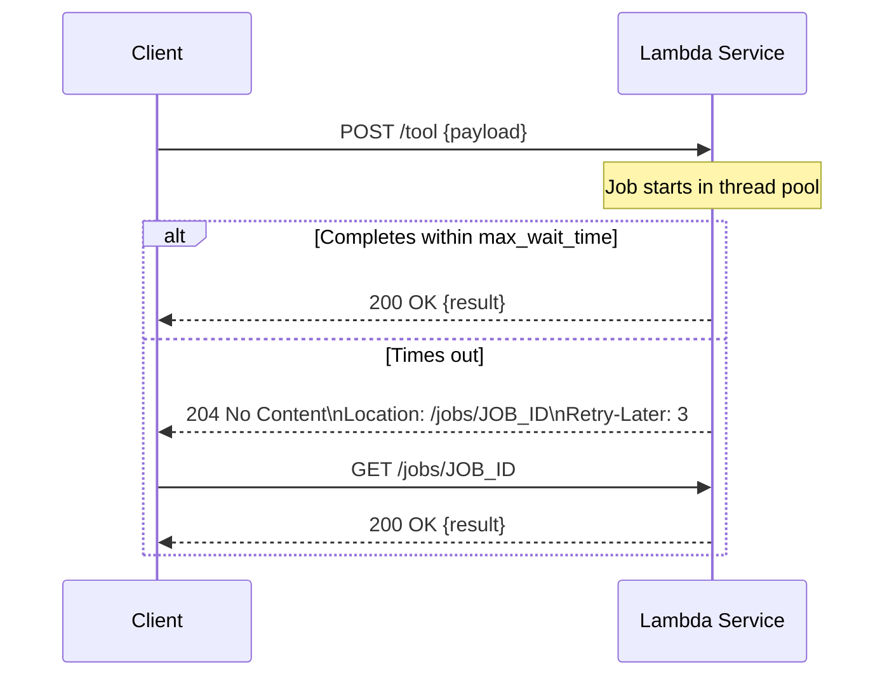

# Tool Functions Guide

The `@ivcap_lambda` decorator is the heart of the lambda SDK. It turns any Python function into a set of HTTP endpoints that IVCAP and AI agents can call.

## Defining a Tool

### Request & Result Models

Tool inputs and outputs are [Pydantic](https://docs.pydantic.dev/) `BaseModel` classes. Use the `@with_schema` decorator (from `ivcap_service`) to annotate them with an IVCAP schema URI. This injects a `$schema` field that the platform uses to identify payloads.

```python
from pydantic import BaseModel, Field
from ivcap_service import with_schema

@with_schema("urn:example:schema:my-tool.request.1")
class MyRequest(BaseModel):
    name: str = Field(..., description="Name to greet.")
    count: int = Field(1, description="Number of times to repeat the greeting.", ge=1)

@with_schema("urn:example:schema:my-tool.1")
class MyResult(BaseModel):
    greeting: str = Field(..., description="The generated greeting.")
```

!!! tip "Always use `@with_schema`"
    Never add a `$schema` or `jschema` field manually. The `@with_schema` decorator handles this for you, and it must be present for IVCAP to correctly identify the payload type.

### The `@ivcap_lambda` Decorator

```python
from ivcap_lambda import ivcap_lambda, ToolOptions

@ivcap_lambda("/greet", opts=ToolOptions(tags=["Greeter"], service_id="/greet"))
def greet(req: MyRequest) -> MyResult:
    """Greet a person

    Generates a personalised greeting the requested number of times.
    Describe your tool here — this text is surfaced to AI agents to
    help them decide whether to use it.
    """
    return MyResult(greeting=(f"Hello, {req.name}! " * req.count).strip())
```

The first paragraph of the docstring becomes the endpoint **summary**; the rest becomes the **description** shown in Swagger and returned in tool descriptions.

### ToolOptions Reference

| Field | Default | Description |
|---|---|---|
| `name` | (inferred from path) | Human-readable name for the tool endpoint |
| `tags` | (inferred from path) | OpenAPI tags for grouping endpoints |
| `max_wait_time` | `5.0` | Seconds the `POST` waits before returning `204 Try-Later` |
| `refresh_interval` | `3` | `Retry-Later` header value (seconds) returned with `204` |
| `service_id` | `None` | Overrides the service ID in the tool description |
| `post_route_opts` | `{}` | Extra kwargs forwarded to the FastAPI route constructor |
| `executor_opts` | `None` | `ExecutorOpts` (cache size/TTL, thread-pool size) |
| `is_ready` | `None` | Callable that returns `False` while the tool is initialising |

**`service_id`:** If set to a path (e.g. `"/"` or `"/greet"`), the server prepends the public URL prefix automatically, so agents receive a fully-qualified service ID.

## Accessing the Job Context

Your tool function can optionally accept a `JobContext` (from `ivcap_service`) as a keyword argument. The framework detects it by type annotation and injects it automatically.

```python
from ivcap_service import JobContext

@ivcap_lambda("/process", opts=ToolOptions(tags=["Processor"]))
def process(req: MyRequest, jobCtxt: JobContext) -> MyResult:
    """Process a request"""
    logger.info(f"job_id={jobCtxt.job_id}")
    with jobCtxt.report.step("work", "Starting work...") as step:
        result = do_work(req)
        step.finished(f"Finished!")
    return MyResult(...)
```

`JobContext` fields (from `ivcap_service`):

| Field | Type | Description |
|---|---|---|
| `job_id` | `str` | The unique job identifier (URN) |
| `report` | `EventReporter` | For emitting progress events to the platform |
| `job_authorization` | `str \| None` | Bearer token for authenticated calls |
| `ivcap` | `IVCAP` | IVCAP client for artifacts, services, etc. |

## Accessing the FastAPI Request

Optionally accept `fastapi.Request` to read raw headers or query parameters:

```python
from fastapi import Request as FRequest

@ivcap_lambda("/process")
def process(req: MyRequest, freq: FRequest, jobCtxt: JobContext) -> MyResult:
    user_agent = freq.headers.get("user-agent", "unknown")
    logger.info(f"Called by: {user_agent}")
    ...
```

Both `FRequest` and `JobContext` are detected by type annotation and injected by the framework. They can appear in any order after the first (request model) parameter.

## Async Tools

Async functions are fully supported. The executor creates a new event loop per job in a thread pool:

```python
import asyncio

@ivcap_lambda("/async-greet", opts=ToolOptions(tags=["Greeter"]))
async def async_greet(req: MyRequest) -> MyResult:
    """Greet asynchronously

    Same as greet but runs in an async context.
    """
    await asyncio.sleep(0)  # yield once
    return MyResult(greeting=f"Hello, {req.name}!")
```

## Endpoints Created per Tool

For each `@ivcap_lambda`-decorated function at path `{prefix}`, three routes are registered:

| Method | Path | Purpose |
|---|---|---|
| `POST` | `{prefix}` | Submit a job (execute the tool) |
| `GET` | `{prefix}` | Return a tool description (for agents / MCP) |
| `GET` | `/jobs/{job_id}` | Poll for the result of a deferred job |

Additionally, the framework registers:

- `GET /_healtz` — health check (returns `{"version": "..."}`)
- `GET /api` — Swagger/OpenAPI UI
- `GET /mcp` — MCP endpoint (only if `--with-mcp` is passed at startup)

## Asynchronous ("Try-Later") Semantics

When a job takes longer than `ToolOptions.max_wait_time` (default 5 s), the `POST` returns **`204 No Content`** with:

```
Location: /jobs/{job_id}
Retry-Later: 3
```

The caller can then `GET /jobs/{job_id}` after the indicated delay to collect the result.



### Forcing Async Behaviour

You can force the `204` response immediately (useful when you know the job will be long):

```bash
curl -i -X POST http://localhost:8090/greet \
  -H "Prefer: respond-async" \
  -H "content-type: application/json" \
  -d '{"name": "IVCAP"}'
```

Or override the timeout per request:

```bash
curl -i -X POST http://localhost:8090/greet \
  -H "Timeout: 30" \
  -H "content-type: application/json" \
  -d '{"name": "IVCAP"}'
```

## Registering Multiple Tools

A single service can register multiple tools at different paths:

```python
@ivcap_lambda("/greet", opts=ToolOptions(tags=["Greeter"]))
def greet(req: GreetRequest) -> GreetResult:
    """Greet a person"""
    ...

@ivcap_lambda("/summarise", opts=ToolOptions(tags=["Text"]))
def summarise(req: SummariseRequest) -> SummariseResult:
    """Summarise text"""
    ...

@ivcap_lambda("/analyse", opts=ToolOptions(tags=["Analysis"]))
def analyse(req: AnalyseRequest) -> AnalyseResult:
    """Analyse data"""
    ...

if __name__ == "__main__":
    start_lambda_server(service)
```

Each tool gets its own `POST` and `GET` endpoints. The `--print-tool-description` flag accepts the tool name to select which one to print.

## Tool Readiness

If your tool requires initialisation (e.g., loading a model), use `is_ready` to hold back the health check until it's done:

```python
_model = None

def _is_model_ready() -> bool:
    return _model is not None

@ivcap_lambda("/predict", opts=ToolOptions(tags=["ML"], is_ready=_is_model_ready))
def predict(req: PredictRequest) -> PredictResult:
    """Run a prediction"""
    ...

# Load model at startup
_model = load_model("model.pkl")
```

## See Also

- [`@ivcap_lambda` API](../api/decorators.md)
- [`ToolOptions` API](../api/executor.md)
- [Observability Guide](observability.md) — Progress events
- [Error Handling Guide](error-handling.md)
