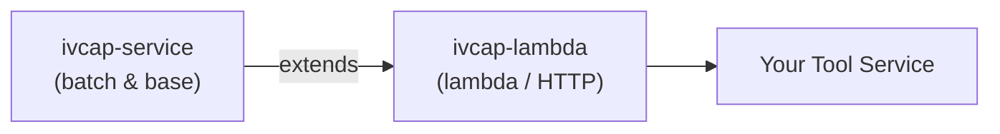

# IVCAP Lambda SDK for Python

Welcome to the **IVCAP Lambda SDK** (`ivcap-lambda`) — a Python library for building **lambda-style HTTP services** that integrate with the IVCAP data and compute platform.

This SDK extends [`ivcap-service`](https://ivcap-works.github.io/ivcap-service-sdk-python/) — the base library for IVCAP services — and adds HTTP scaffolding via FastAPI and uvicorn for services that respond to individual tool invocations (rather than processing jobs from a queue). If you need queue-based batch processing, see the [ivcap-service SDK](https://ivcap-works.github.io/ivcap-service-sdk-python/) instead.

`ivcap-lambda` handles all the scaffolding so you can focus on your tool logic:

- ✅ **Tool registration** — `@ivcap_lambda` decorator turns any function into HTTP endpoints
- ✅ **Async job semantics** — try-later (`204 No Content`) pattern for long-running calls
- ✅ **Job context injection** — automatic `JobContext` and platform credentials
- ✅ **Progress reporting** — stream structured events back to the IVCAP platform
- ✅ **Artifact access** — upload and download files via `JobContext.ivcap`
- ✅ **MCP support** — optional Model Context Protocol endpoint for AI agent tooling
- ✅ **OpenTelemetry** — distributed tracing with FastAPI instrumentation
- ✅ **Type safety** — fully typed with Pydantic models

## Relationship with `ivcap-service`



`ivcap-service` provides the foundational building blocks: `Service`, `JobContext`, `EventReporter`, `with_schema`, `getLogger`, artifact management, and the sidecar reporter.  `ivcap-lambda` wraps these with a FastAPI application, asynchronous executor, and per-tool endpoint registration.

## Quick Example

```python
from pydantic import BaseModel, Field
from ivcap_service import Service, getLogger, with_schema
from ivcap_lambda import start_lambda_server, ivcap_lambda, ToolOptions, logging_init

logging_init()
logger = getLogger("my-service")

service = Service(
    name="My IVCAP Lambda Service",
    description="A minimal echo service.",
    contact={"name": "Alice", "email": "alice@example.com"},
    license={"name": "MIT", "url": "https://opensource.org/licenses/MIT"},
)


@with_schema("urn:example:schema:echo.request.1")
class EchoRequest(BaseModel):
    message: str = Field(..., description="The message to echo back.")


@with_schema("urn:example:schema:echo.1")
class EchoResult(BaseModel):
    echo: str = Field(..., description="The echoed message.")


@ivcap_lambda("/", opts=ToolOptions(tags=["Echo"]))
def echo(req: EchoRequest) -> EchoResult:
    """Echo a message

    Returns the message passed in the request unchanged.
    """
    return EchoResult(echo=req.message)


if __name__ == "__main__":
    start_lambda_server(service)
```

## Getting Started

New to IVCAP lambda services? Start here:

1. **[Installation](getting-started/installation.md)** — Set up the SDK
2. **[Quick Start](getting-started/quick-start.md)** — Run your first service in minutes
3. **[Your First Lambda Service](getting-started/first-service.md)** — Build a complete example

## Learn by Example

Check out the [Examples](examples/tool-service.md) section for complete, working services including:

- Echo / greeting tools with sync and async handlers
- Artifact download and upload workflows
- MCP-enabled services for AI agent tooling

## Core Concepts

### Tool Functions

Every lambda service is built around one or more **tool functions** decorated with `@ivcap_lambda`. The decorator registers three HTTP endpoints — a `POST` to submit jobs, a `GET` to collect results, and a `GET` for the tool description. Learn more:

- [Tool Functions Guide](guides/tool-functions.md)
- [`@ivcap_lambda` API](api/decorators.md)

### Asynchronous Job Semantics

When a tool takes longer than `ToolOptions.max_wait_time` (default 5 s), the server returns a `204 No Content` with `Location` and `Retry-Later` headers so callers can poll for the result later. See [Tool Functions Guide](guides/tool-functions.md#asynchronous-try-later-semantics).

### IVCAP Platform Integration

Your tool integrates with the platform through `JobContext`:

- Artifact management (download inputs, upload results)
- Progress events and step reporting
- Service discovery and composition

### MCP & Agent Integration

Lambda services can optionally expose a [Model Context Protocol](https://modelcontextprotocol.io/) endpoint (`/mcp`) to make tools directly available to AI agent frameworks. See the [MCP Guide](guides/mcp.md).

## Next Steps

- **Read [Guides](guides/overview.md)** for deep dives into each feature
- **Browse [API Reference](api/overview.md)** for complete class/function documentation
- **Check [Best Practices](guides/best-practices.md)** for production patterns
- **Deploy** with our [Deployment Guide](guides/deployment.md)

## Where to Find Help

- **GitHub Issues**: [Report bugs or ask questions](https://github.com/ivcap-works/ivcap-ai-tool-sdk-python/issues)
- **Contributing**: [Contributions welcome!](community/contributing.md)
- **Code of Conduct**: [Community standards](community/conduct.md)

## License

This project is licensed under the [BSD License](https://github.com/ivcap-works/ivcap-ai-tool-sdk-python/blob/main/LICENSE).

---

**Happy building! 🚀**
